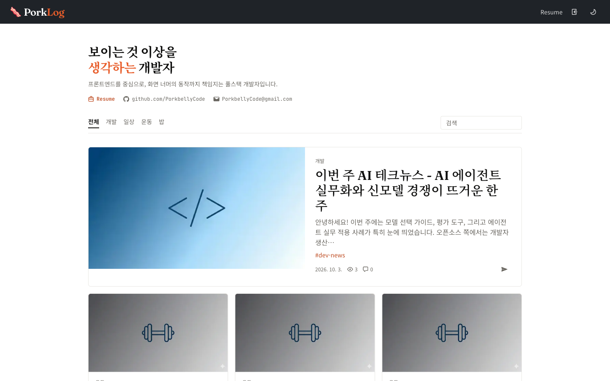

# PorkLog

[](https://github.com/PorkbellyCode/PorkLog/actions/workflows/ci.yml)

Next.js 16과 Neon Postgres로 만든 DB 기반 기술 블로그 겸 포트폴리오입니다. 예약 발행·시리즈 연재, 방문자 통계 대시보드, 매주 자동 발행되는 AI Tech 뉴스까지 혼자 설계·구현·배포·운영하고 있습니다.

🔗 **라이브** → https://porklog.dev · [Portfolio](https://porklog.dev/portfolio) · [Resume](https://porklog.dev/resume)



## 주요 기능

### 블로그
- 게시글 CRUD — 마크다운 에디터, 이미지 업로드, 상세 화면과 같은 렌더러를 쓰는 미리보기
- 예약 발행 · 비공개 글 — 이미 공개된 글은 발행일시를 바꿀 수 없게 서버에서 고정
- 카테고리 탭 · 태그 · 제목/본문 검색 · 페이지네이션
- 시리즈 연속 읽기 — 회차는 저장 시 서버가 자동으로 매김
- 본문 목차(TOC) · 스크롤 위치를 따라가는 TOC 레일 · 이전/다음 글 이동
- 코드 하이라이팅(Shiki), 다크/라이트 모드
- Giscus 댓글과 목록의 댓글 수 집계, 조회수, 공유(네이티브 공유 시트·링크 복사)

### 포트폴리오
- **Resume** (`/resume`) — 경력·회사 프로젝트·기술 스택, 인쇄 전용 스타일로 PDF 저장
- **Portfolio** (`/portfolio`) — 사이드 프로젝트별 라이브 서비스 스크린샷과 "문제 → 선택 → 결과" 기술 결정

### AI 주간 Tech 뉴스
- Vercel Cron이 매주 RSS·GitHub 급상승 레포·Hugging Face·OpenRouter 네 곳에서 소식을 수집
- LLM이 요약해 `dev-news` 시리즈로 자동 발행
- DB에 쓰지 않고 수집·요약·스키마 검증까지만 해보는 드라이런 스크립트 제공

### 운영
- 관리자 통계 대시보드 — 오늘/누적 방문자, 기간별 방문 추이, 인기 글(자체 집계) + GA4 유입 채널·기기
- SEO — 동적 sitemap, robots, canonical, OG 카드, RSS 피드(`/feed.xml`)

## 기술 결정

- **공개된 글의 발행일시는 서버에서 고정** — 예약 발행을 넣자 이미 공개된 글의 발행일시도 바꿀 수 있게 됐습니다. 서버가 발행 시각이 지난 글의 변경 값을 무시하고, 폼에서도 입력을 막았습니다. 이 규칙은 Vitest 테스트로 고정했습니다.
- **수집처 하나가 실패해도 뉴스는 발행** — 네 곳을 `Promise.allSettled`로 병렬 수집해, 일부가 실패해도 나머지로 요약을 진행합니다.
- **Cron 재실행에도 중복 발행 없음** — 같은 날짜의 글이 이미 있으면 건너뛰고, Cron 엔드포인트는 `CRON_SECRET`으로 보호합니다.

## 기술 스택

| 분류 | 사용 기술 |
| --- | --- |
| **Core** | Next.js 16 (App Router), React 19, TypeScript (strict) |
| **Styling** | Tailwind CSS v4, shadcn/ui, GitHub Primer를 참고한 자체 스타일, next-themes |
| **Database** | Neon Postgres (serverless), Drizzle ORM |
| **Auth** | Better Auth (공개 가입 없이 관리자 1인 로그인) |
| **Content** | `@uiw/react-md-editor`, unified · remark · rehype, Shiki(rehype-pretty-code) |
| **Comments** | Giscus (GitHub Discussions) |
| **Storage** | Vercel Blob (썸네일·본문 이미지) |
| **Analytics** | 자체 방문자·조회수 집계, Google Analytics 4 (Data API), Recharts |
| **AI** | OpenAI API (주간 Tech 뉴스 요약) |
| **Test / CI** | Vitest, GitHub Actions (`main` 푸시·PR마다 lint · typecheck · test) |
| **Deploy** | Vercel (자동 배포, Vercel Cron) |

## 프로젝트 구조

```
src/
├── app/                # 페이지(posts, portfolio, resume, admin/stats)와 API(auth, cron, upload, preview, visit)
├── components/         # UI 컴포넌트 (ui/ 는 shadcn/ui)
├── db/                 # Drizzle 스키마
└── lib/
    ├── post-actions.ts # 글 생성·수정·삭제 Server Actions
    ├── markdown.ts     # unified 기반 마크다운 렌더링
    ├── projects.ts     # Resume·Portfolio 콘텐츠
    └── tech-digest/    # 수집(fetch-*) → 요약(summarize) → 발행(create-digest-post)
```

## 로컬 실행

```bash
pnpm install
pnpm dev                    # http://localhost:3000
pnpm lint --max-warnings=0  # CI와 같은 검증
pnpm typecheck
pnpm test                   # .env.test 의 테스트 전용 DB 사용 (테스트마다 posts 테이블을 비움)
```

<details>
<summary>환경변수 (<code>.env.local</code>)</summary>

| 변수 | 용도 |
| --- | --- |
| `DATABASE_URL` | Neon Postgres 연결 문자열 |
| `BETTER_AUTH_SECRET` | Better Auth 세션 서명 |
| `ADMIN_EMAIL`, `ADMIN_PASSWORD`, `ADMIN_NAME` | `scripts/seed-admin.ts`로 관리자 계정 생성 |
| `BLOB_READ_WRITE_TOKEN` | Vercel Blob 업로드 |
| `GITHUB_TOKEN` | 댓글 수 집계(GitHub Discussions), GitHub 급상승 레포 수집 |
| `OPENAI_API_KEY`, `OPENROUTER_API_KEY` | Tech 뉴스 요약 · OpenRouter 급상승 모델 수집 |
| `CRON_SECRET` | Cron 엔드포인트 보호 |
| `GA_MEASUREMENT_ID` | GA4 수집 (프로덕션에서만 로드) |
| `GA_PROPERTY_ID`, `GA_SERVICE_ACCOUNT_EMAIL`, `GA_SERVICE_ACCOUNT_PRIVATE_KEY` | 관리자 통계의 GA4 Data API 조회 |

</details>

## AI와 함께 개발하기

Claude Code를 멀티 에이전트로 구성해 개발합니다. 메인 세션이 설계를 맡고, frontend·backend가 구현하고, critic이 리뷰와 검증을, reader가 독자 관점의 문구 점검을 맡습니다. 역할 정의는 `.claude/agents/`, 작업 규칙은 [`CLAUDE.md`](./CLAUDE.md)에 있습니다.

---

> 이 프로젝트는 일부러 작은 단위로 커밋했습니다. [`git log`](https://github.com/PorkbellyCode/PorkLog/commits)에서 각 기능이 어떤 순서로, 어떤 결정과 함께 쌓였는지 따라갈 수 있습니다.
